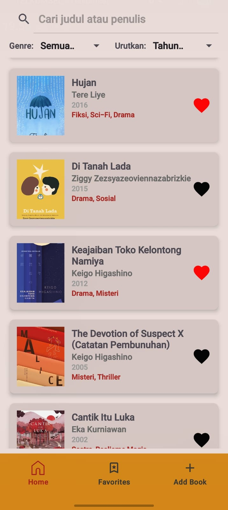
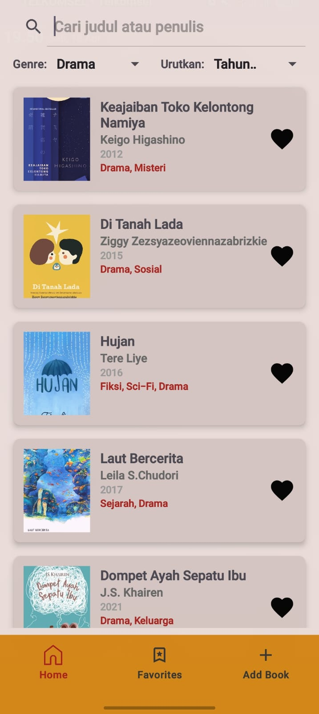
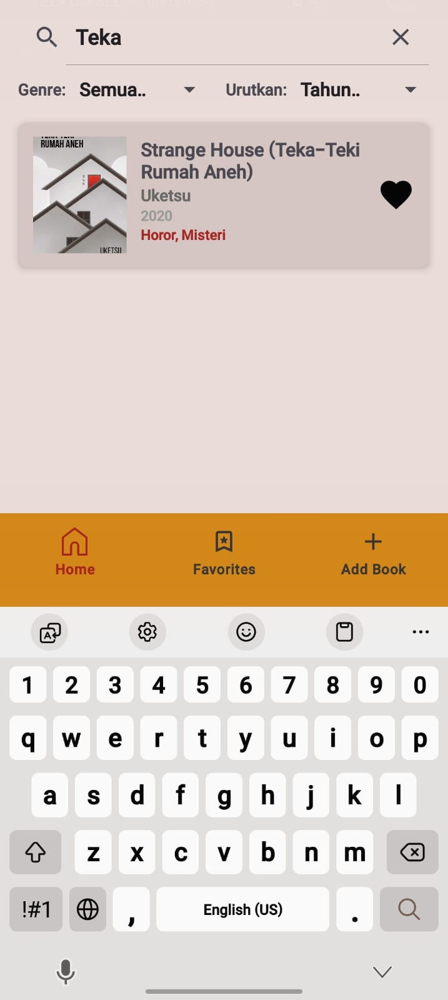
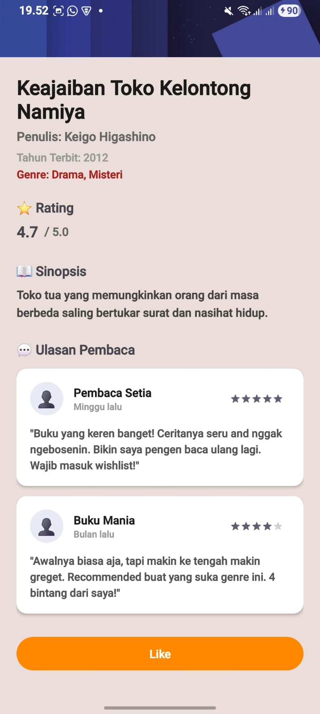
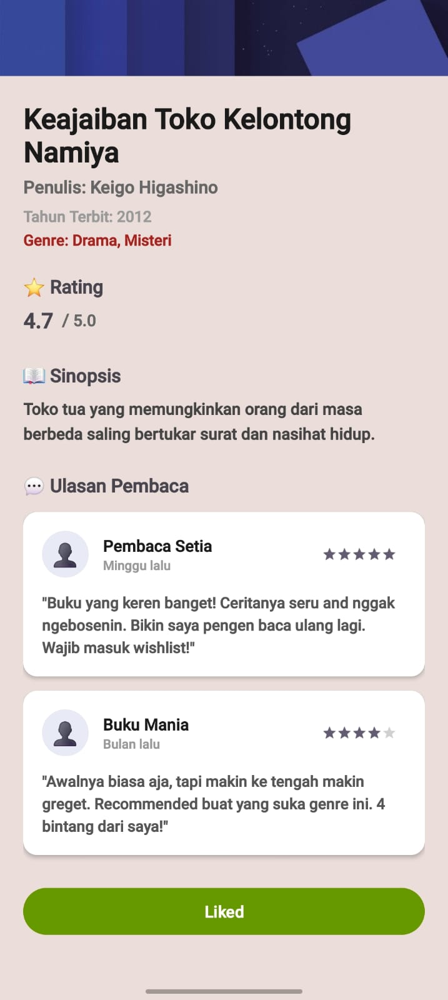
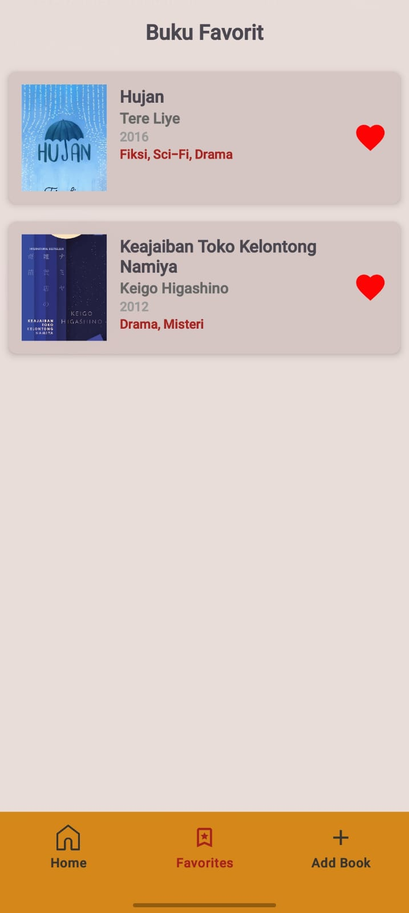
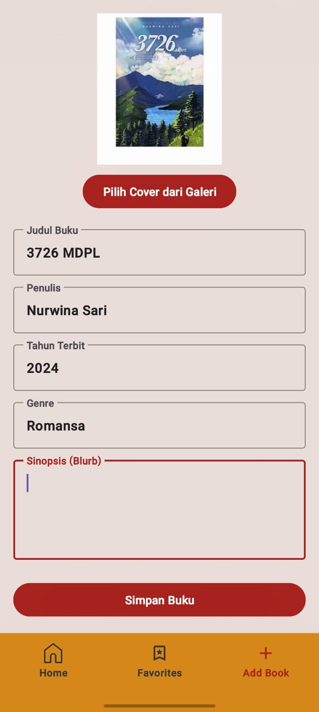
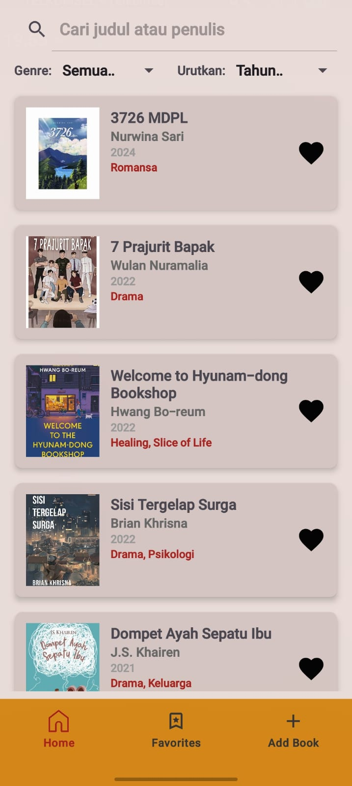

# Tugas Praktikum 3 - Aplikasi Library App

> **Nama:** Zahra Aulia Putri 
> **NIM:** H071241025 

---

## 📱 Deskripsi Aplikasi

Aplikasi **Library App** adalah aplikasi manajemen buku sederhana berbasis Android yang memungkinkan pengguna untuk:
- Melihat daftar buku
- Mencari buku
- Memfilter berdasarkan genre
- Mengurutkan buku
- Menandai buku favorit
- Menambah buku baru
- Melihat detail lengkap buku

### Halaman Utama:
1. **Home** → Daftar buku + search, filter, sorting  
2. **Favorites** → Buku yang di-like  
3. **Add Book** → Form tambah buku  

---

## ✅ Fitur Aplikasi

### 📌 Home (Daftar Buku)
- RecyclerView vertical
- 15+ data buku dummy 
- SearchView berdasarkan judul / penulis
- Filter genre (multiple genre)
- Sorting Buku berdasarkan:
  - Tahun terbaru
  - Tahun terlama
  - Judul A-Z
  - Judul Z-A
- Klik buku → DetailActivity

### 📌 Favorites
- Menampilkan buku yang di-like
- Auto refresh saat fragment tampil (onResume)

### 📌 Add Book
- Input:
  - Judul
  - Penulis
  - Tahun
  - Genre
  - Sinopsis
- Ambil cover dari galeri
- Preview gambar
- Buku muncul di Home

### 📌 Detail Buku
- Info lengkap buku
- Nilai numerik rating buku
- 2 review realistis
- Tombol Like / Unlike

---

## 🏗️ Struktur Project

### 📁 Package & Class

```text
com.example.tp3/
├── Book.java
├── DataDummy.java
├── BookAdapter.java
├── FragmentHome.java
├── FavoritesFragment.java
├── AddBookFragment.java
├── DetailActivity.java
└── MainActivity.java
````

---

### 📁 Layout Files

| File                   | Fungsi                   |
| ---------------------- | ------------------------ |
| activity_main.xml      | Main + Bottom Navigation |
| activity_detail.xml    | Detail buku              |
| fragment_home.xml      | Home                     |
| fragment_favorites.xml | Favorites                |
| fragment_add_book.xml  | Add Book                 |
| item_book.xml          | Item RecyclerView        |

---


## 📊 Data Dummy (15 Buku)

| No | Judul                           | Penulis          | Tahun | Genre                  |
| -- | ------------------------------- | ---------------- | ----- | ---------------------- |
| 1  | 7 Prajurit Bapak                | Wulan Nuramalia  | 2022  | Drama                  |
| 2  | Cantik Itu Luka                 | Eka Kurniawan    | 2002  | Sastra, Realisme Magis |
| 3  | The Devotion of Suspect X       | Keigo Higashino  | 2005  | Misteri, Thriller      |
| 4  | Dompet Ayah Sepatu Ibu          | J.S. Khairen     | 2021  | Drama, Keluarga        |
| 5  | Hilmy Milan                     | Nadia Ristivani  | 2021  | Romantis, Drama        |
| 6  | Hujan                           | Tere Liye        | 2016  | Fiksi, Sci-Fi, Drama   |
| 7  | Welcome to Hyunam-dong Bookshop | Hwang Bo-reum    | 2022  | Healing                |
| 8  | Laut Bercerita                  | Leila S. Chudori | 2017  | Sejarah                |
| 9  | The Midnight Library            | Matt Haig        | 2020  | Fantasi                |
| 10 | Keajaiban Toko Kelontong Namiya | Keigo Higashino  | 2012  | Drama                  |
| 11 | Pulang-Pergi                    | Tere Liye        | 2021  | Aksi                   |
| 12 | Seporsi Mie Ayam Sebelum Mati   | Brian Khrisna    | 2021  | Drama                  |
| 13 | Sisi Tergelap Surga             | Brian Khrisna    | 2022  | Psikologi              |
| 14 | Di Tanah Lada                   | Ziggy Z.         | 2015  | Sosial                 |
| 15 | Strange House                   | Uketsu           | 2020  | Horor                  |

---

## 🔄 Alur Navigasi

### Bottom Navigation

```
Home → Favorites → Add Book
```

### Home

* Search → filter judul/penulis
* Filter genre
* Sorting
* Klik → Detail

### Favorites

* List buku yang di-like
* Klik → Detail

### Add Book

* Isi form
* Pilih gambar
* Preview
* Simpan → muncul di Home

### Detail

* Info lengkap
* Rating + review
* Like / Unlike

---

## 💾 Penyimpanan Data

Tanpa database / SharedPreferences
Menggunakan **ArrayList (memory)**

```java
public class DataDummy {
    private static ArrayList<Book> bookList = new ArrayList<>();

    public static void addBook(Book book) {
        bookList.add(0, book);
    }

    public static ArrayList<Book> getAllBooks() {
        return new ArrayList<>(bookList);
    }
}
```

## 🌟 Fitur Tambahan

* ⭐ Rating buku
* 📝 Review realistis
* 🎭 Filter multi-genre
* 🔄 Sorting

---

## 🛠️ Cara Menjalankan

1. Buka di Android Studio
2. Minimum SDK: API 21
3. Sync Gradle
4. Run di emulator / device
5. Izinkan akses galeri

---


## 📸 Screenshot

### Home



### Filter

#### Filter Genre : Drama
#### Sorting : Tahun terlama → Tahun terbaru


#### Search Buku


### Detail



#### Detail buku favorite : (button like telah ditekan)


### Favorites



### Add Book



#### Setelah buku ditambahkan akan muncul di halaman Home paling atas :



---

## 👨‍💻 Kesimpulan

Aplikasi berhasil mengimplementasikan:

* Bottom Navigation
* RecyclerView (search, filter, sorting)
* 15+ data buku
* Tambah buku + galeri
* Detail + rating + review
* Like system

Berjalan dengan baik di Android API 21+

---

**Terima kasih 🙏**

