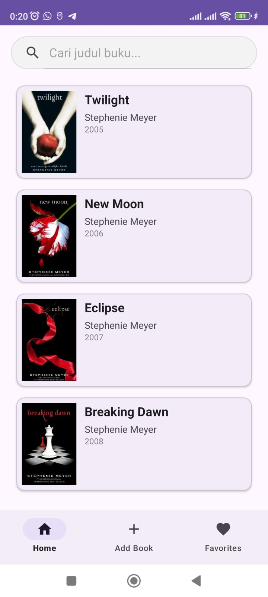
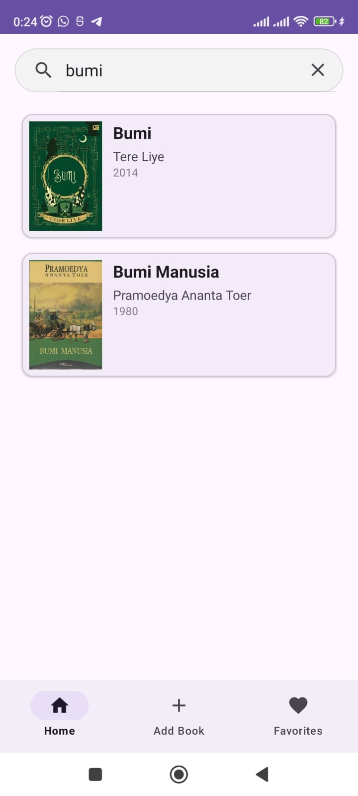
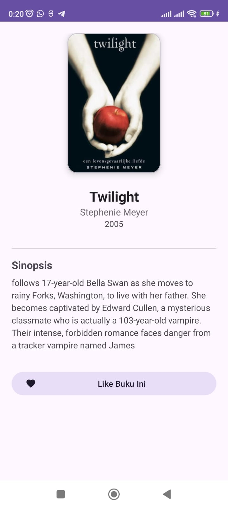
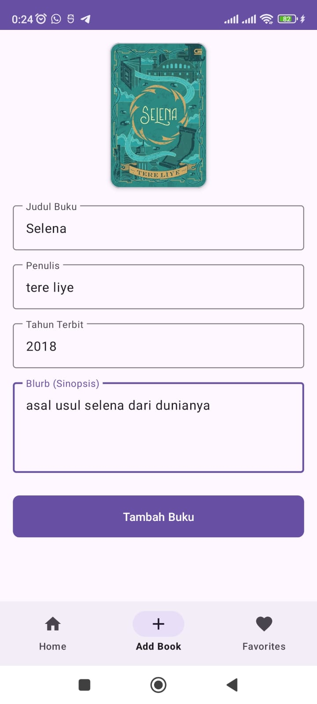
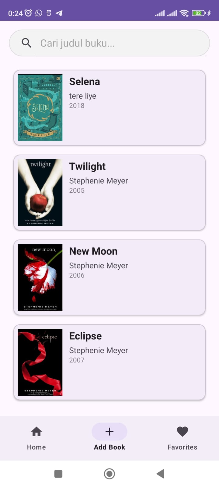
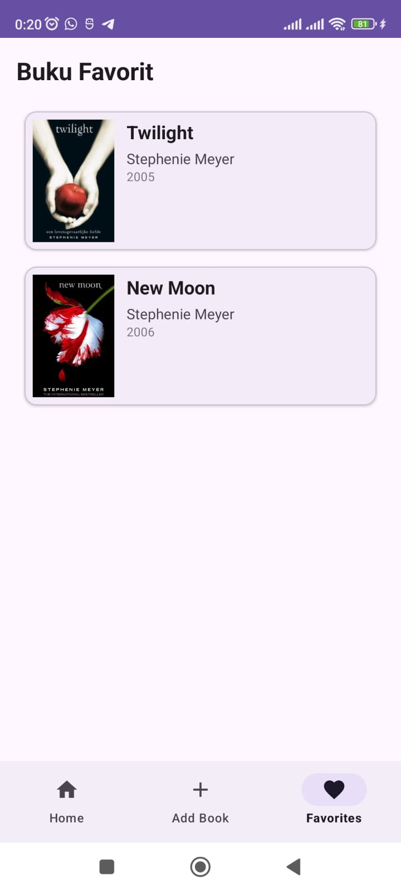

# Library App - Tugas Praktikum 3 Pemrograman Mobile

Aplikasi manajemen perpustakaan pribadi berbasis Android yang dibangun menggunakan **Java** dan **Material Design 3**. Aplikasi ini memungkinkan pengguna untuk mengelola daftar buku, melakukan pencarian, menandai favorit, serta menambahkan koleksi baru langsung dari galeri perangkat.

---

## Deskripsi Aplikasi
Library App dirancang untuk memberikan pengalaman manajemen literatur yang intuitif bagi mahasiswa. Aplikasi ini menerapkan arsitektur *Fragment-based* dengan navigasi tunggal melalui `BottomNavigationView`. Pengelolaan data dilakukan secara *in-memory* menggunakan desain pola **Singleton** untuk memastikan konsistensi data antar fragmen tanpa perlu melakukan *query* database yang berat selama masa pengembangan.

---

## Fitur Utama
* **Home (Dashboard)**: Menampilkan seluruh koleksi buku (minimal 15 data dummy) menggunakan `RecyclerView`.
* **Search Engine**: Pencarian buku secara real-time berdasarkan judul melalui `SearchView`.
* **Detail View**: Informasi mendalam mencakup judul, penulis, tahun terbit, sinopsis (blurb), dan sampul buku.
* **Favorite System**: Fitur "Like" untuk mengkurasi buku pilihan yang tersimpan secara dinamis di tab Favorites.
* **Add Book**: Form penambahan buku baru dengan fitur integrasi Galeri (Image Picker) menggunakan `ActivityResultLauncher`.
* **Dynamic Sorting**: Buku yang baru ditambahkan secara otomatis akan muncul di urutan paling atas.

---

## Pemahaman Algoritma & Arsitektur

### 1. Desain Pola Singleton (BookRepository)
Untuk memenuhi ketentuan "tidak menggunakan database", aplikasi menggunakan **Singleton Pattern** pada kelas `BookRepository`.
* **Algoritma**: Memastikan hanya ada satu *instance* repository yang hidup selama aplikasi berjalan.
* **Manfaat**: Sinkronisasi data menjadi konsisten. Saat buku ditandai "Like" di `DetailActivity`, `FavoriteFragment` akan langsung merefleksikan perubahan tersebut karena merujuk pada objek memori yang sama.

### 2. Algoritma Filtering (Searching)
Pencarian menggunakan teknik **Linear Filtering** pada `ArrayList`.
* **Mekanisme**: Saat pengguna mengetik di `SearchView`, sistem akan melakukan iterasi pada salinan data asli. Setiap judul yang mengandung karakter yang dicari (menggunakan `.contains()` dan `.toLowerCase()`) akan dimasukkan ke dalam list temporer yang kemudian ditampilkan kembali oleh Adapter.
* **Kompleksitas**: O(n), sangat efisien untuk data skala kecil hingga menengah.

### 3. Implementasi RecyclerView & Adapter
* **View Holder Pattern**: Digunakan untuk meminimalisir penggunaan `findViewById` berulang kali, sehingga proses *scrolling* daftar tetap halus.
* **Glide Library**: Digunakan untuk manajemen *image loading* yang efisien, baik untuk gambar dari resource drawable maupun URI dari penyimpanan internal (galeri).

### 4. Fragment Lifecycle Management
Aplikasi memanfaatkan metode `onResume()` pada `FavoriteFragment` untuk melakukan *data-refresh*. Ini memastikan bahwa status "Like" yang berubah saat pengguna berada di halaman detail akan langsung diperbarui saat pengguna kembali ke tab Favorites.

---

## Dokumentasi Fitur (Screenshots)

### Koleksi & Eksplorasi
| Dashboard Utama | Fitur Pencarian | Detail Informasi |
| :---: | :---: | :---: |
|  |  |  |
| *Daftar 15 buku dummy* | *Hasil filter query judul* | *Informasi & Tombol Like* |

### Penambahan Koleksi & Favorit
| Form Tambah Buku | Hasil Setelah Tambah | Koleksi Favorit |
| :---: | :---: | :---: |
|  |  |  |
| *Input data & akses galeri* | *Buku baru tampil di posisi atas* | *Kurasi buku yang di-Like* |

---

## Teknologi yang Digunakan
* **Bahasa**: Java
* **UI Framework**: Material Design 3 (M3)
* **Library**:
  * `androidx.recyclerview:recyclerview`
  * `com.github.bumptech.glide:glide`
  * `com.google.android.material:material`
* **Modern API**: `ActivityResultLauncher` untuk pemilihan gambar galeri.

---

## 👤 Identitas Pengembang
**Nama**: Isnadiyah Nur Fadhilah  
**NIM**: H071241052  
**Program Studi**: Sistem Informasi  
**Instansi**: Universitas Hasanuddin (Unhas)